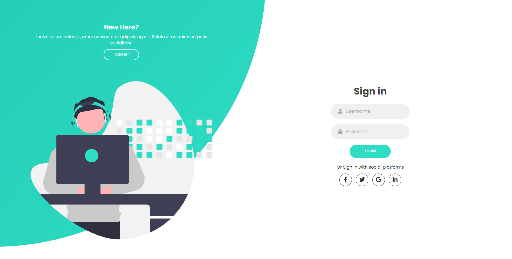
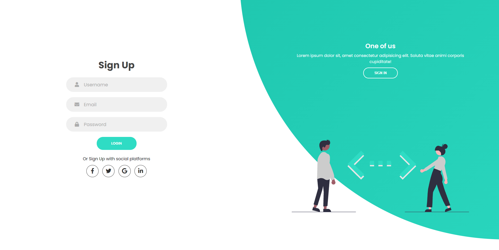

<h1 align="center">Sign-in and Sign-up</h1>

## Descrição do Projeto

Este projeto é baseado em uma tela de login, e em uma tela de cadastro.

### Features

- [x] Sign-in-form
- [x] Sign-up-form

### Skills

### Inspiração

 O projeto foi inspirado do canal: <a href="https://youtu.be/I5_T547tHf0">Web Dev</a>

<h2 align="center"> 
	 🚀 Projeto concluído com sucesso... 🚀
</h2>

<h3 align="center" style="font-weight: 600";>Primeira tela</h3>

<h3 align="center" style="font-weight: 600";>Segunda tela</h3>

